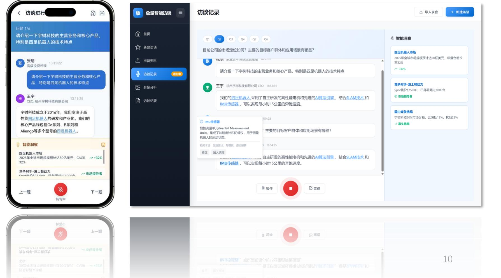
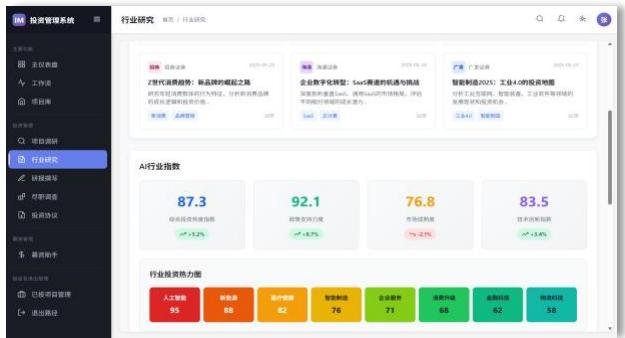
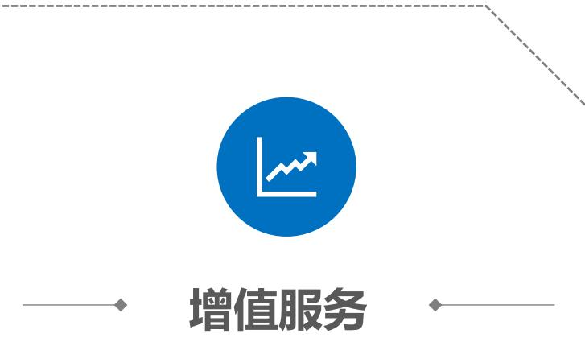
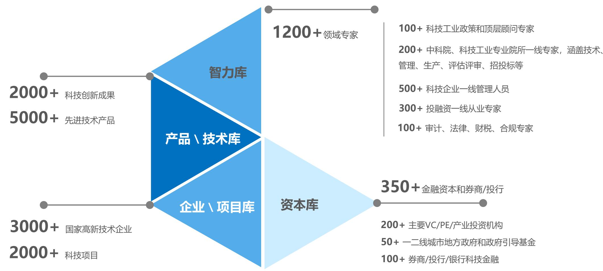

AI+大数据投资研究智能体

# 象量科技项目介绍

象无形，量有度。

# 项目简介

象量科技AI+大数据投资研究智能体是由专业科技产业研究机构钛禾智库孵化，旨在通过人工智能专业大模型技术打造一体化投资研究和融资对接智能体，让早期项目发现、理解与决策效率提升10倍。

平台深度融合多模态数据处理能力与垂直领域产业认知，构建覆盖科技产业全链条的智能分析系统，为投资机构、科技企业和地方政府提供从趋势预判、标的筛选到资源对接的全链路解决方案，助力中国科技创新生态实现精准化、系统化的价值发现与资源配置。

# 使命愿景

成为中国科技产业投资与创新的智能中枢，通过AI重构创投市场研究范式和投资逻辑，打造全球领先的AI $^ +$ 智库型投行。

# 投资亮点

国内首家基于人工智能的科技行业投资研究平台

极高的市场天花板，清晰的商业变现路径

产品 $^ +$ 技术+数据三重壁垒构建未来竞争护城河

团队成员均为一线资深从业者，复合履历高度适配

# 01市场分析

# 通用人工智能时代来临，一级市场投融资范式将深刻改变

# 主要痛点：“盲人摸象”

• 信息茧房：科技行业技术分支复杂繁多，行业/项目验证数据和佐证材料匮乏，团队背景、技术成熟度难以量化评估

• 认知滞后：依靠人工的研究方式难以跟踪技术迭代速度、市场发展变化速度

• 市场难判：科技创业者缺乏产业洞察，$40 \%$ 融资BP存在市场空间误判（自研调研数据）

• 信息过载：海量财报、新闻、舆情数据难以人工处理

• 主观偏差：传统分析依赖经验，缺乏实时动态验证

• 长尾需求：中小机构/企业难以承担顶级投行服务费用

# 主要痛点：“缘木求鱼”

• 信息黑洞：创业者与投资机构对彼此需求、背景、资源缺乏了解，导致匹配效率低下

• 方法错位：缺少寻找合适投资人的方法；技术术语与商业逻辑难以兼容，项目价值无法被清晰传达

• 信任缺失：早期项目缺乏成熟数据或市场验证，团队能力与愿景可信度易受质疑

• 资源错配：机构短期回报要求与科技项目长周期、高风险特性不符

• 估值分歧：创业者对技术潜力高预期与投资人保守评估矛盾

流程低效：冗长的尽调、决策流程和多层审核机制，消耗初创团队时间，延误发展窗口

# AI赋能投资研究+大数据赋能精准对接

消除两端认识差

弥合信息裂痕

精准配置资源

高效辅助决策

技术平权带来投融资平权

# 数字技术赋能股权投资的各阶段，均成就了一批现象级公司

# 基于通用大模型深度开发的AI投研智能体可渗透千亿级刚需市场

# 核心市场

仅直接采购服务一项，每年存在数百亿潜在市场规模

<table><tr><td rowspan=1 colspan=1>客户类型</td><td rowspan=1 colspan=1>需求场景</td><td rowspan=1 colspan=1>付费能力</td><td rowspan=1 colspan=1>全国数量</td></tr><tr><td rowspan=1 colspan=1>市场化VC/PE机构</td><td rowspan=1 colspan=1>行业研究、项目初筛、投资风控、尽职调查、投后管理、募资管理</td><td rowspan=1 colspan=1>中（小机构年预算¥20万+，大机构定制化采购，100万+年预算)</td><td rowspan=1 colspan=1>超过12000家备案机构</td></tr><tr><td rowspan=1 colspan=1>政府引导基金/招商部门</td><td rowspan=1 colspan=1>标的寻找、项目初筛、投资风控、尽职调查、投后管理</td><td rowspan=1 colspan=1>高 (定制化采购，100万+年预算)</td><td rowspan=1 colspan=1>超过2300只政府引导基金，省级开发区总数量2200余个，国家级开发区233个</td></tr><tr><td rowspan=1 colspan=1>上市公司战投部门</td><td rowspan=1 colspan=1>并购标的挖掘、产业链缺口预警较高(50万+年预算或定制化采购)</td><td rowspan=1 colspan=1>并购标的挖掘、产业链缺口预警较高(50万+年预算或定制化采购)</td><td rowspan=1 colspan=1>境内上市公司5400余家</td></tr><tr><td rowspan=1 colspan=1>科技创业公司</td><td rowspan=1 colspan=1>融资规划指导、投资机构反向尽调、BP生成优化、可持续融资体系构建</td><td rowspan=1 colspan=1>中 (数万-数十万/年)</td><td rowspan=1 colspan=1>仅国家高新技术产业超过50万家</td></tr><tr><td rowspan=1 colspan=1>银行/保险科技金融部门</td><td rowspan=1 colspan=1>行业特征分析、项目尽调、投资方案设计、风险控制</td><td rowspan=1 colspan=1>高 (定制化采购，100万+年预算)</td><td rowspan=1 colspan=1>上万个分支机构</td></tr></table>

数据来自相关主管部门，统计截止到2025年3月

延伸市场： FA机构、个人投资者、券商/买方机构投研部门、财富管理机构、律师事务所/会计师事务所等

# AI+投研智能体有望突破传统投研模式的能力上限

<table><tr><td rowspan=2 colspan=1>维度</td><td rowspan=2 colspan=1></td><td rowspan=2 colspan=1>传统投行（如高盛、野村)</td><td rowspan=2 colspan=1>通用数据平台（如Wind、36氪)</td><td rowspan=2 colspan=1>象量投研</td></tr><tr></tr><tr><td rowspan=1 colspan=1>技术理解深度</td><td rowspan=1 colspan=1></td><td rowspan=1 colspan=1>依赖专家经验</td><td rowspan=1 colspan=1>研报（二手信息）/粗颗粒标签</td><td rowspan=1 colspan=1>多模态分析+技术路线推演</td></tr><tr><td rowspan=1 colspan=1>数据维度</td><td rowspan=1 colspan=1></td><td rowspan=1 colspan=1>商业数据为主</td><td rowspan=1 colspan=1>表面财务数据</td><td rowspan=1 colspan=1>多源异构产业数据融合</td></tr><tr><td rowspan=1 colspan=1>信息处理能力</td><td rowspan=1 colspan=1></td><td rowspan=1 colspan=1>依靠人工处理海量信息</td><td rowspan=1 colspan=1>二维数据简单分析</td><td rowspan=1 colspan=1>AI动态推理+大数据聚合分析</td></tr><tr><td rowspan=1 colspan=1>决策支持</td><td rowspan=1 colspan=1></td><td rowspan=1 colspan=1>静态报告</td><td rowspan=1 colspan=1>数据看板</td><td rowspan=1 colspan=1>动态情景模拟</td></tr><tr><td rowspan=1 colspan=1>覆盖场景</td><td rowspan=1 colspan=1></td><td rowspan=1 colspan=1>依靠人力拓展，慢</td><td rowspan=1 colspan=1>数据积累拓展，较慢</td><td rowspan=1 colspan=1>知识库积累+大模型推理，快速</td></tr><tr><td rowspan=1 colspan=1>人力替代</td><td rowspan=1 colspan=1></td><td rowspan=1 colspan=1>极度依赖人力</td><td rowspan=1 colspan=1>几乎无法替代人力</td><td rowspan=1 colspan=1>真正实现人力成本替代</td></tr><tr><td rowspan=1 colspan=1>适用客户</td><td rowspan=1 colspan=1></td><td rowspan=1 colspan=1>定向委托客户</td><td rowspan=1 colspan=1>低定制化客群</td><td rowspan=1 colspan=1>灵活适应各类客群</td></tr><tr><td rowspan=1 colspan=1>服务成本</td><td rowspan=1 colspan=1></td><td rowspan=1 colspan=1>高</td><td rowspan=1 colspan=1>中</td><td rowspan=1 colspan=1>低</td></tr></table>

# 从国家部委到省、市政府，连续出台一系列直接利好政策

# 国家部委

2024年，国家数据局等17个部门联合发布《“数据要素×”三年行动计划（2024—2026年）》

引导企业开放数据，支持数据商上市融资

# 浙江省

2025年5月，浙江省政府发布《关于支持人工智能创新发展的若干措施》

市建设人工智能产业发展高地实施方案（2025年版）》 27条具体举措，旨在2027年前打造3家千亿级链主企业，培育30家百亿级龙头企业

杭州市

2025年4月，杭州市政府发布《杭州市建设人工智能产业发展高地实施方案（2025版）》

在算力、模型、核心技术、应用生态、人才、企业成长、数据等方面给予定向支持，旨在培育形成具有国际一流水平的基础大模型2个，具有行业重大影响力的行业应用模型25个以上

# 02产品体系

# 通过高频应用工具开发切入市场

# 国内约有70万名以上一线投资经理，每天发生数千场现场调研访谈

访谈提纲智能生成

专业术语实时匹配

口述信息智能校准

行业背景智能提示

逻辑漏洞智能指正

访谈纪要一键整理

调研影像智能分析

# 核心价值：UGC x AIGC模式沉淀高质量产业数据

# 多模态大模型与行业知识图谱深度融合

通过将碎片化访谈转化为结构化知识网络，与既有产业数据/知识融合，实现从数据沉淀到决策增强的能力闭环，成为一级市场投资研究新一代基础设施级技术工具。

基于数据底座开发实用模块：从单点提效到全流程重构  

<table><tr><td rowspan=1 colspan=1>场景</td><td rowspan=1 colspan=1>传统方案</td><td rowspan=1 colspan=1>象量方案</td><td rowspan=1 colspan=1>效能提升</td></tr><tr><td rowspan=1 colspan=1>调研访谈</td><td rowspan=1 colspan=1>人工记录+手动整理</td><td rowspan=1 colspan=1>语音转录→信息校对→逻辑匹配→智能整理</td><td rowspan=1 colspan=1>耗时95%；错误率\60%</td></tr><tr><td rowspan=1 colspan=1>标的初筛</td><td rowspan=1 colspan=1>BP搜集（行业人脉）+人工阅读处理</td><td rowspan=1 colspan=1>智能画像→算法匹配+智能推荐+自然语言查询</td><td rowspan=1 colspan=1>耗时↘85%；成本60%</td></tr><tr><td rowspan=1 colspan=1>行业数据分析</td><td rowspan=1 colspan=1>阅读研报+查阅资料+人工处理</td><td rowspan=1 colspan=1>要素定义→资料上传→AI自动生成报告</td><td rowspan=1 colspan=1>耗时↘95%；错误率↘60%</td></tr><tr><td rowspan=1 colspan=1>投资管理</td><td rowspan=1 colspan=1>大量人工+少量辅助软件</td><td rowspan=1 colspan=1>工作流自动化+智能项目库+考核智能化</td><td rowspan=1 colspan=1>综合管理成本↘40%</td></tr><tr><td rowspan=1 colspan=1>合同审核</td><td rowspan=1 colspan=1>律师逐条检查</td><td rowspan=1 colspan=1>风险条款智能分析+修订建议</td><td rowspan=1 colspan=1>耗时×80%</td></tr><tr><td rowspan=1 colspan=1>投后管理</td><td rowspan=1 colspan=1>人力跟进</td><td rowspan=1 colspan=1>全网舆情自动监控+多维数据互动→智能推荐赋能方案</td><td rowspan=1 colspan=1>综合成本↓50%</td></tr><tr><td rowspan=1 colspan=1></td><td></td><td></td><td></td></tr><tr><td rowspan=1 colspan=1>场景</td><td rowspan=1 colspan=1>传统方案</td><td rowspan=1 colspan=1>象量方案</td><td rowspan=1 colspan=1>效能提升</td></tr><tr><td rowspan=1 colspan=1>融资规划</td><td rowspan=1 colspan=1>人工记录+手动整理</td><td rowspan=1 colspan=1>资料上传→逻辑抽取→数据校对→智能规划</td><td rowspan=1 colspan=1>耗时80%；错误率\60%</td></tr><tr><td rowspan=1 colspan=1>机构反向尽调</td><td rowspan=1 colspan=1>有限资料+行业人脉打听</td><td rowspan=1 colspan=1>自然语言查询→智能画像→算法匹配→智能分析</td><td rowspan=1 colspan=1>耗时×90%</td></tr><tr><td rowspan=1 colspan=1>BP管理</td><td rowspan=1 colspan=1>人工撰写+手动修改</td><td rowspan=1 colspan=1>原始资料→叙事风格匹配→逻辑重写→AI自动生成不同版本</td><td rowspan=1 colspan=1>耗时↘95%；错误率↘60%</td></tr><tr><td rowspan=1 colspan=1>谈判博弈</td><td rowspan=1 colspan=1>个人经验+专业咨询</td><td rowspan=1 colspan=1>关键信息抽取+逻辑推演+沙盘模拟</td><td rowspan=1 colspan=1>综合成本×60%</td></tr><tr><td rowspan=1 colspan=1>合同审核</td><td rowspan=1 colspan=1>律师逐条检查</td><td rowspan=1 colspan=1>风险条款智能分析+修订建议</td><td rowspan=1 colspan=1>耗时80%</td></tr><tr><td rowspan=1 colspan=1>行业情报/对手监测</td><td rowspan=1 colspan=1>人力跟进</td><td rowspan=1 colspan=1>全网舆情自动监控+多维数据互动→智能推荐赋能方案</td><td rowspan=1 colspan=1>综合成本50%</td></tr></table>

# 聚焦两类核心用户，逐步形成覆盖日常工作的能力

核心用户：一线投资经理 & 企业董秘/融资负责人  

<table><tr><td colspan="2">机构端</td><td>企业端</td><td colspan="2">平台端</td></tr><tr><td colspan="2">智能投资管理系统+投研助手</td><td>智能融资管家</td><td colspan="2">AIGC投融资门户+数据中台</td></tr><tr><td>智能项目库搭建</td><td>投资工作流搭建</td><td>智能融资规划 投资机构匹配</td><td>AIGC投融资门户</td><td>定制化聚合信息推送</td></tr><tr><td>智能调研工具</td><td>重点行业/赛道研究</td><td>投资机构反向尽调 BP智能管理</td><td>AIGC行业指数/榜单</td><td>项目对接/投融资社区</td></tr><tr><td>AI风控建议</td><td>投资协议起草/审核</td><td>合同审核 模拟谈判博弈</td><td>数据中台</td><td>智能分析引擎</td></tr><tr><td>已投项目管理</td><td>智能募资助手</td><td>行业情报/对手监控 舆情监控/风险识别</td><td>产业全要素数据库</td><td>服务与应用支撑</td></tr></table>

  
产品示例

# 基于通用大模型深度开发行业垂直模型，打造AI+投研智能体

# 六大亮点技术，构筑核心技术护城河

# 面向不同目标客户群体，采取差异化收费模式

# 付费订阅制

◼ 免费版：免费提供部分基础功能  
◼ 基础版：¥99-199/月/人 $^ +$ （基础数据库$^ +$ 常用功能）  
◼ 专 业 版 ： ¥8,000/ 月 / 机 构 $^ +$ （ 全功能$+ \mathsf { A P } |$ I接入）  
◼ 流量付费：根据算力实际使用量和个性化功能使用量扣费  
◼ 大型投资机构/企业/政府部门定制化解决方案包： $\yen 1,000,000$ 定制工具包/硬件部署 $^ +$ 日常维护（服务器私有化部署 $^ +$ 一体化解决方案  
定制 $^ +$ 知识库数据库定制）

◼ 数据衍生品销售：各类定制报告◼ 融资顾问服务：收取 $1 \% - 3 \%$ 成功费◼ 资产管理：基金管理 $2 \%$ 管理费 $^ +$ Carry

# 前三年筑基固本，三年后实现裂变式增长

# 种子期 2025.Q4

完成产品内测版开发行业客户免费试用+头部基金案例打造

# 成长期 2026年

根据用户反馈持续优化产品，推出正式版产品微信公众号持续发布AIGC报告，积累行业影响力

# 成熟期 2028年

# 加速期 2027年

完善算法和功能模块，覆盖25个以上行业赛道，开发迭代版产品规模化拓展行业用户，实现正向现金流

开发进阶版产品，拓展业务边界  
巩固行业头部地位，建立行业标准，开启裂变式增长

2027年陆续启动B轮、B+轮融资

2026年底  
启动A轮融资，估值8-10  
亿

# 导入钛禾智库历史积累数据，加速模型成熟

# 技术+运营+推广多位一体打造产品增长飞轮

核心指标预测   

<table><tr><td rowspan=1 colspan=1>指标</td><td rowspan=1 colspan=1>第一年 (2026)</td><td rowspan=1 colspan=1>第二年(2027)</td><td rowspan=1 colspan=1>第三年（2028)</td></tr><tr><td rowspan=1 colspan=1>订阅付费客户</td><td rowspan=1 colspan=1>2000+种子用户</td><td rowspan=1 colspan=1>15,000+个人用户(机构/企业)</td><td rowspan=1 colspan=1>30,000+个人用户(机构/企业)</td></tr><tr><td rowspan=1 colspan=1>ARPU</td><td rowspan=1 colspan=1>1,000+</td><td rowspan=1 colspan=1>1,000+</td><td rowspan=1 colspan=1>2,000+</td></tr><tr><td rowspan=1 colspan=1>本地部署客户</td><td rowspan=1 colspan=1>10+</td><td rowspan=1 colspan=1>50+</td><td rowspan=1 colspan=1>200+</td></tr><tr><td rowspan=1 colspan=1>营收</td><td rowspan=1 colspan=1>1000万</td><td rowspan=1 colspan=1>5000万</td><td rowspan=1 colspan=1>1.5亿</td></tr><tr><td rowspan=1 colspan=1>净利润</td><td rowspan=1 colspan=1>/</td><td rowspan=1 colspan=1>1000万+</td><td rowspan=1 colspan=1>3000万+</td></tr><tr><td rowspan=1 colspan=1>核心数据壁垒</td><td rowspan=1 colspan=1>8-10个赛道覆盖</td><td rowspan=1 colspan=1>30个赛道覆盖</td><td rowspan=1 colspan=1>100+赛道覆盖</td></tr></table>

# 构建“技术+制度”双轨合规体系，平衡效率与风险

# 1. 数据合规管理

# 2. 算法合规设计

从数据、算法、隐私、监管等多个维度入手，构建全面的合规体系。

来源合法性：遵循GDPR、PIPL等法规，确保数据采集知情同意  
分类分级：敏感数据（如身份信息、财务数据）加密存储，设置动态权限。  
跨境传输：遵守数据本地化要求，采用SCC等标准化协  
生命周期：定期清理过期数据，建立不可逆销毁机制透明性与可解释性：避免“黑箱”操作，引入可解释AI（XAI）模型  
公平性保障：定期审计算法偏见，确保无歧视（如行业/地域偏好)  
风控机制：上线前压力测试，设置熔断与异常检测系统  
动态优化：持续监控性能，记录版本更新日志

# 3. 隐私与安全体系

# 4. 合规监管框架

# 5. 技术工具支持

加密技术：AES-256加密传输，敏感字段脱敏处理  
访问控制：基于角色（RBAC）限制权限，定期审查  
网络安全：部署防火墙、IDS，定期渗透测试  
应急响应：制定数据泄露预案，定期演练法规遵循：适配SEC、CSRC等监管要求，关注ISO 27001动态  
第三方管理：签订DPA协议，尽职调查供应商合规性  
审计与培训：内部合规检查+第三方审查，定期员工培训数据治理平台：Collibra/Alation实现全生命周期管理  
算法监控工具：Prometheus实时跟踪，Fairlearn检测公平性  
隐私计算：联邦学习、同态加密实现安全多方协作

# 前景展望

# ◼ AI+投研有望弥合一二级市场的裂痕，创造新的价值投资范式

  
国内外同行对标（部分）

# 未来会成为怎样的公司？

成为中国科技产业投资与创新的智能中枢，通过AI重构一级市场研究范式，打造全球领先的AI+智库型投行。

服务中国科技创新与产业升级

打造AI时代的中国版高盛or野村

# 04 团队介绍

# 项目由专业产业和投资研究机构钛禾智库孵化

◼ 支撑工信部、国防科工局等国家部委开展多项政策研究、产业调研、技术性研究等专项委托课题和各类先进技术项目评估评审等工作。

◼ 为十余个省、市、区政府提供产业规划和政策咨询、产业链诊断、科技成果转化咨询等服务

服务多支国家级政府引导基金和千亿规模产业投资基金，完成10余个行业赛道的深入研究以及多个先进技术项目的投资尽调，累计推荐项目超过600个，过会项目超过20个

◼ 为数十家500强企业、上市公司、领军科技企业提供并购/投融资咨询、项目申报、资本市场价值管理等服务

# 互联网产品开发+投资研究+投资实践复合经验团队

# 刘畅 | CEO

# 陈平川 | 产品负责人

# 何蒸 | 联合创始人

钛禾智库/象量投研创始人、《大航天时代》等产业研究专著作者。

八年产业研究和投资咨询经验。长期支撑工信部、国防科工局等国家部委研究工作，服务十余个地方政府的发展规划和产业研究；为累计超3500亿人民币规模股权投资基金提供行业研究和投资尽调服务，为数十家上市公司、头部科技企业提供并购/投融资咨询服务。

近十年互联网产品经验，曾就职网易、阿里巴巴，历任运营主管、市场经理、产品总监等；参与创办两家独角兽公司并担任核心管理职务。

网易G106员工，资深产品总监二十余年互联网产品开发经验，曾主导开发网易博客、邮箱、相册、教育等多款现象级产品，牵头创建网易杭州研究院产品部。

# 杨XX | 技术负责人

网易、淘宝数据库高级技术专家，某数据库创业公司联合创始人。

十余年数据库开发与技术管理经验，在大数据、人工智能技术开发方面经验丰富。

本科就读于浙江大学竺可桢学院混合班，后赴欧留学获得TUE&JKU双硕士学位；曾任紫金港资本浙江区投资总监，投资案例有波长光电、微泰医疗、杰普特、德适生物等。

# 唐颖红 | 人力资源总监

毕业于浙江工业大学法学专业，曾任职网易、浙大研究院、赛思倍斯等知名企业和研究机构，长期从事人力资源、公司财税法、科技项目申报等方面管理与实践工作。

# 05

融资需求

# 融资机构与成本预算

象为体：价值根基赋予投资以“魂”，如象之沉稳。

量为用：量化技术赋予投资以“眼”，如尺之精确。

无形为境：超越工具理性，回归“不争之争”的生态博弈。

“市场如巨象，看似庞杂无序，实则暗藏肌理。我们不做驯兽鞭，只做读懂象语的听诊器。”

谢谢！2025年8月