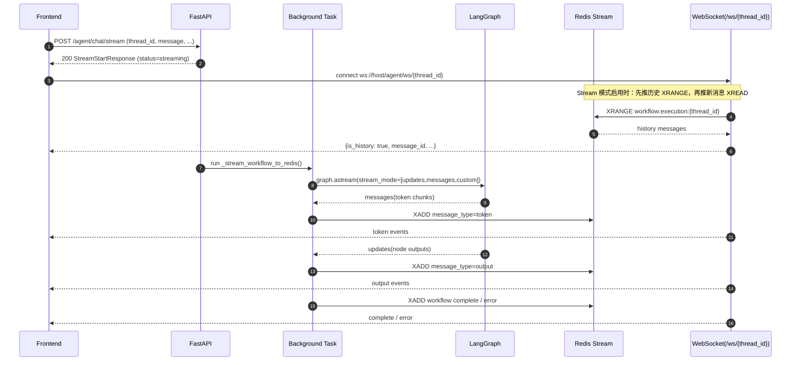
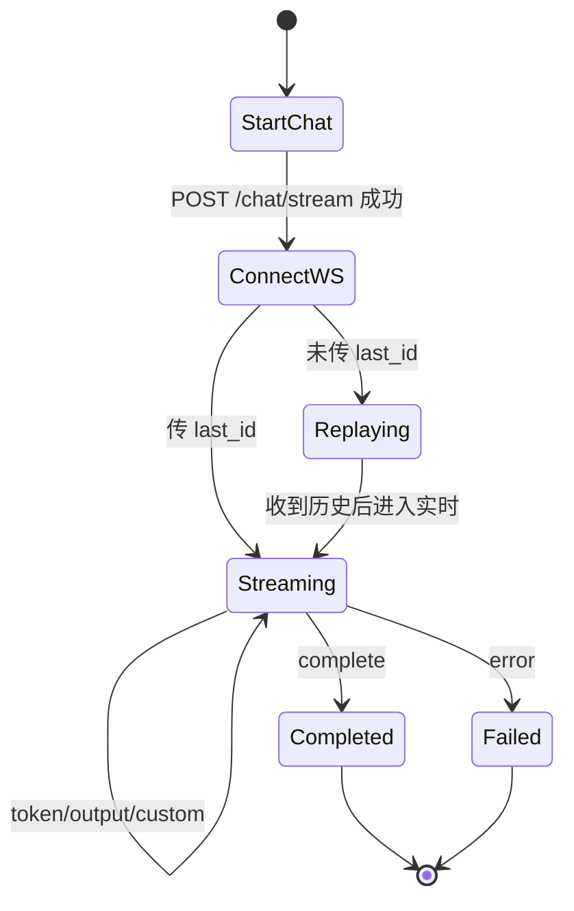
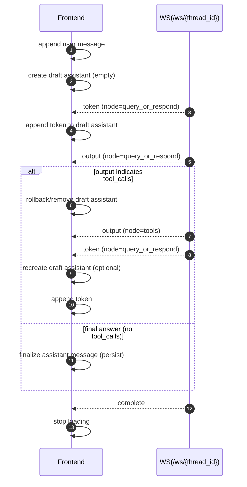

# Backend API（前端对接说明）

本文档基于当前后端实际暴露的接口（chat / stream / history / documents）整理，目标是让前端可以稳定完成：
- 发起一次对话（流式）
- 订阅同一 thread 的实时事件（token / 节点 output / complete / error）
- 加载历史对话（用户可见版本）
- 文档上传与转换（MarkItDown / MinerU）

> 后端基于 FastAPI；路由注册位置见 src/api/app.py。

---

## 1. 基本信息

- Base URL：由部署决定（例如本地 `http://localhost:8000/agent`，线上 `https://www.gravaity-cybernaut.top/agent`）
- CORS：当前允许任意来源（开发友好）
- 鉴权：当前接口未实现鉴权（如需鉴权建议在网关层补充）
- 线程标识：`thread_id` 是所有对话/流式/历史的主键

---

## 2. 端到端对接流程（推荐）



```mermaid
flowchart TD
  A[用户输入 message] --> B[POST /chat/stream]
  B --> C[收到 thread_id]
  C --> D[连接 WS /ws/{thread_id}]
  D --> E{收到事件 message_type?}
  E -->|token| T[增量渲染 token]
  E -->|output| O[处理节点 output]
  E -->|custom| U[更新自定义状态]
  E -->|complete| F[停止 loading]
  E -->|error| X[展示错误并停止]
```

---

## 3. Chat（启动工作流）

### 3.1 启动一次流式对话

- Method：POST
- Path：`/agent/chat/stream`
- Content-Type：`application/json`

请求体：ChatRequest
- `thread_id`（string，必填）：会话线程 ID（前端生成并持久化）
- `user_id`（string，可选）：用户 ID（用于记忆命名空间隔离）
- `message`（string，必填）：用户输入
- `chat_model`（string，可选）：模型名（如未传使用后端默认）
- `enable_websearch`（bool，可选，默认 false）：是否启用 web search
- `documents`（array，可选）：上传文档内容（每项含 filename/format/markdown_content）

响应体：StreamStartResponse
- `thread_id`（string）：同请求
- `user_id`（string|null）：同请求
- `ws_channel`（string）：历史遗留字段（用于 Pub/Sub 模式的 pattern），前端通常不需要
- `status`（string）：固定为 `streaming`

重要语义
- 该接口“立即返回”，不等待 LangGraph 执行完成
- 实际执行结果通过 WebSocket 事件流返回
- 即使工作流后台失败，该接口也可能已 200 返回；失败以 `workflow:error` 事件通知

---

## 4. Stream（WebSocket 事件流）

### 4.1 连接 WebSocket

- Path：`/agent/ws/{thread_id}`
- Query：`last_id`（可选）

两种使用模式
- **首次连接（不传 last_id）**：服务端会先发送该 thread 的 Stream 历史（带 `is_history: true`），然后开始推送新消息。
- **断线续订（传 last_id）**：服务端从该 `last_id` 之后开始阻塞读取新消息。

注意
- `last_id` 仅在 **Redis Stream 模式** 有意义。
- 如果后端配置为 Pub/Sub 降级模式，断线续订与历史回放能力会受限。

---

### 4.2 WebSocket 消息结构（Stream 模式）

当启用 Redis Stream 时，WebSocket 每条消息是一个 JSON 对象，字段来自 Redis Stream 的 fields。

通用字段
- `message_id`（string）：Redis Stream 的消息 ID（用于前端保存与续订）
- `is_history`（bool，可选）：仅历史回放消息携带，表示这条来自 XRANGE
- `node_name`（string）：节点名（例如 `query_or_respond` / `tools` / `custom` / `workflow`）
- `message_type`（string）：事件类型（见下）
- `status`（string）：事件状态（例如 `streaming` / `completed` / `info` / `completed` / `failed`）
- `timestamp`（string）：时间戳（注意：在 Stream fields 中通常是字符串）
- `data`（string）：JSON 字符串（前端需要 `JSON.parse`）
- `execution_time_ms`（string，可选）：执行耗时（通常是字符串）

message_type 约定
- `token`：LLM token 流式片段（仅部分节点会发）
- `output`：节点完成后的输出（state delta）
- `custom`：节点内部的自定义进度更新
- `complete`：工作流整体完成（`node_name = workflow`）
- `error`：工作流整体失败（`node_name = workflow`）

建议的前端处理逻辑
- 以 `message_type` 做分发，不要硬依赖 `node_name`
- 对 `data` 始终做一次 `JSON.parse`（失败则降级为原字符串展示/记录）

---

### 4.3 WebSocket 消息结构（Pub/Sub 降级模式）

当 Redis Stream 未启用时，WebSocket 会订阅 `workflow:{thread_id}:*` 并直接转发 Pub/Sub 里的 JSON 文本。

与 Stream 模式的差异
- 通常包含 `thread_id` 字段
- 通常不包含 `message_id`（因此也无法用 last_id 续订）
- `data` 字段可能是对象或字符串（取决于发布方序列化）

前端兼容建议
- 优先以是否存在 `message_id` 判断是不是 Stream 模式
- 对 `data` 做容错：对象直接用；字符串尝试 parse

---

## 5. History（对话历史）

### 5.1 获取用户可见历史（推荐）

- Method：GET
- Path：`/agent/chat/threads/{thread_id}/history`

响应体：ThreadHistory
- `thread_id`（string）
- `messages`（array of HistoryMessage）
- `total_messages`（int）

HistoryMessage（前端常用字段）
- `id`（string）
- `role`（user | assistant | system | tool）
- `content`（string）
- `timestamp`（number|null）
- `type`（string）：原始消息类型标记（human/ai/tool/system/…）
- `artifact`（any|null）：某些工具可能附带

服务端过滤规则（非常重要）
- 仅保留：用户消息 + 最终 assistant 回复
- 会过滤掉：tool/system 消息、以及带 tool_calls 的中间 assistant 消息

错误
- thread 不存在：404
- 其他错误：500

---

### 5.2 获取历史 + Trace（调试用）

- Method：GET
- Path：`/agent/chat/threads/{thread_id}/history-with-trace`

额外字段
- `trace_runs`：扁平列表（按 start_time 正序）
- `trace_tree`：树形结构（仅根节点数组，子节点在 children）
- `root_run_id`：根 run id（可用于前端链接到 LangSmith 的某个 run）
- `total_latency_ms`：总耗时（可能为空）
- `total_tokens`：总 token（可能为空）

注意
- 若未配置 LangSmith，trace 相关字段可能为空/缺失统计
- 该接口有额外网络开销，建议仅在调试页面使用

---

### 5.3 删除线程（清空 checkpoint）

- Method：DELETE
- Path：`/agent/chat/threads/{thread_id}`

响应
- 成功：204 No Content

注意
- 这是不可逆操作，会删除该 thread 的所有 checkpoint 记录

---

## 6. Documents（文档处理）

### 6.1 MarkItDown：上传并转换为 Markdown（流式返回）

- Method：POST
- Path：`/agent/documents/process-markitdown`
- Content-Type：`multipart/form-data`
- Form 字段：`files`（可重复，最多 2 个文件）

响应
- `Content-Type: text/event-stream`
- 返回多段 SSE-like 数据块，每段是一行 `data: <json>\n\n`

每个文件会输出一条结果（成功/失败）
- 成功：包含 `markdown_content`
- 失败：包含 `error`

限制
- 单文件最大 50MB，总计最大 100MB
- 单文件转换超时 60 秒

前端实现建议
- 由于这是 POST + 流式响应，浏览器通常用 `fetch` + 读取 response body stream（而不是原生 EventSource）。

---

### 6.2 文档输入：先转 Markdown，再提问（前端只需知道这个流程）

前端如果需要“带文档提问”，推荐流程是：
1) UI 里把文件拖拽/选择进来
2) 调用 `POST /agent/documents/process-markitdown` 把文件转成 Markdown
3) 等转换完成后，把转换结果作为 `documents` 一起传给 `POST /agent/chat/stream` 再开始提问

```mermaid
flowchart TD
  U[用户拖拽/选择文件] --> M[POST /documents/process-markitdown]
  M --> R{每个文件返回
  success/error}
  R -->|success| D[收集 DocumentMetadata
  filename/format/markdown_content]
  R -->|error| E[提示失败
  允许重试/移除文件]
  D --> Q[POST /agent/chat/stream
  message + documents]
  Q --> S[WS /agent/ws/{thread_id}
  渲染 token/output]
```

说明
- 当前后端会把 `documents` 合并进用户消息内容中（用于模型阅读）；前端只需要按 `documents` 字段传入即可。
- MinerU 相关处理接口属于后端离线/内部处理链路，不作为前端对接必需项。

---

## 7. 常见前端落坑点（建议遵守）



- `data` 字段在 Stream 模式下是 JSON 字符串：务必 parse
- `timestamp` / `execution_time_ms` 在 Stream fields 中可能是字符串：需要转 number
- 历史回放消息会带 `is_history: true`：UI 可以选择不触发“正在生成”效果
- complete/error 才表示一次 workflow 结束：不要用某个节点 output 推断结束

### 7.1 流式渲染与“工具回滚”（一轮对话只保留最终 assistant）

后端在 LLM 节点会先产出 token 流；如果该轮需要调用工具（tool_calls），会出现“先有一段 assistant 草稿 token，随后进入 tools”的情况。
推荐前端策略：
- token 只作为“临时草稿”渲染
- 一旦确认该轮触发 tool_calls，则回滚/移除这条草稿 assistant（等待最终回答）
- 最终以 LLM 节点 `output` 且无 tool_calls 的 assistant 内容作为落盘/展示版本



---

## 8. Agent 支持的工具集（让前端知道“可以怎么问”）

说明：工具是否可用会受后端配置影响（例如是否启用项目搜索、是否配置 Tavily key、前端是否在请求里打开 enable_websearch）。

### 8.1 `retrieve_context`（知识库/向量检索）

用途
- 从已入库的 PDF/文档向量库中检索相关内容并返回证据片段

适合的提问方式（示例）
- “根据知识库，概括一下 xxx 项目的背景和关键结论，并列出依据。”
- “在公司内部文档里搜索：xxx，给我出处和摘要。”

### 8.2 `search_projects`（项目库搜索，按配置启用）

用途
- 按关键词查询外部项目管理系统（返回结构化项目信息）

适合的提问方式（示例）
- “帮我查一下 **某公司/某项目** 相关的项目记录与关键信息。”
- “搜索关键词：A、B、C，汇总命中的项目并对比差异。”

### 8.3 `web_search`（联网搜索，按请求开关 + Tavily 配置启用）

用途
- 获取知识库之外的实时信息（新闻、最新动态、外部资料）

适合的提问方式（示例）
- “联网查一下最近关于 xxx 的公开信息，给我摘要与链接线索。”
- “查最新政策/新闻对 xxx 的影响，并给出要点。”

