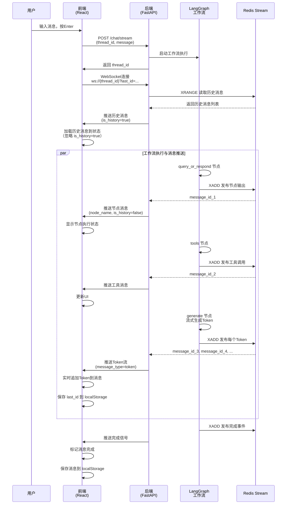
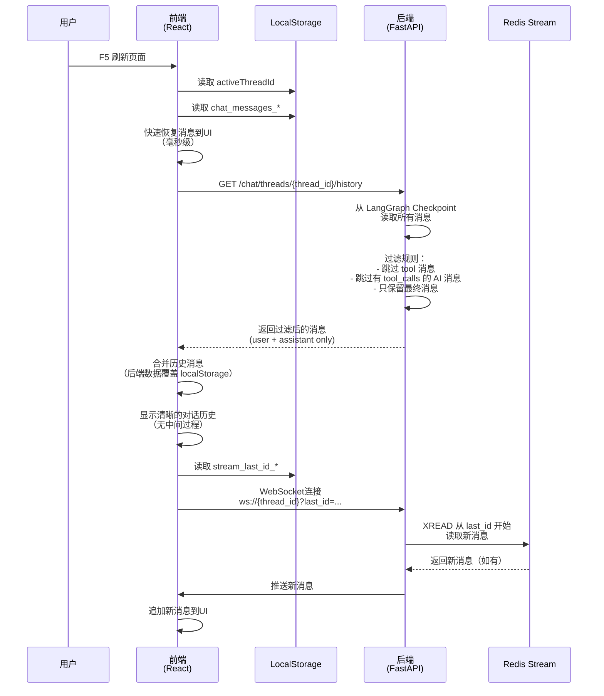
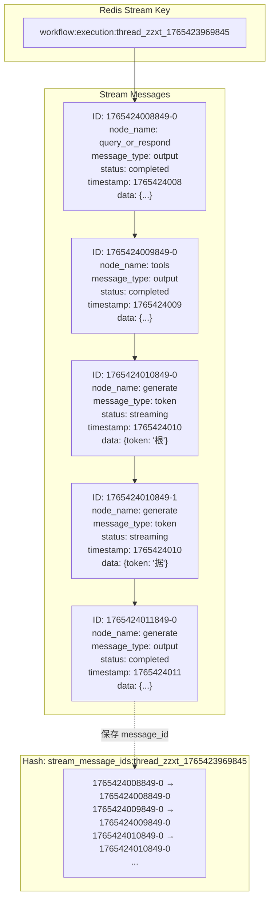
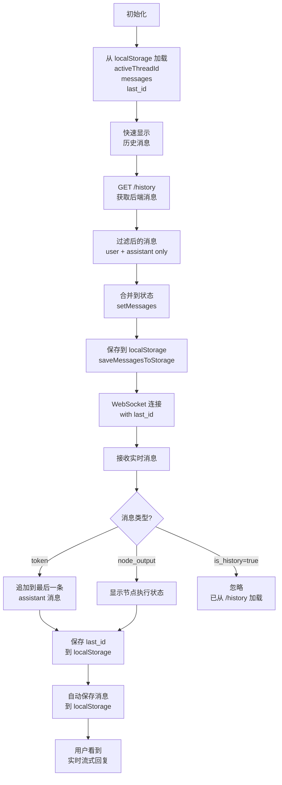
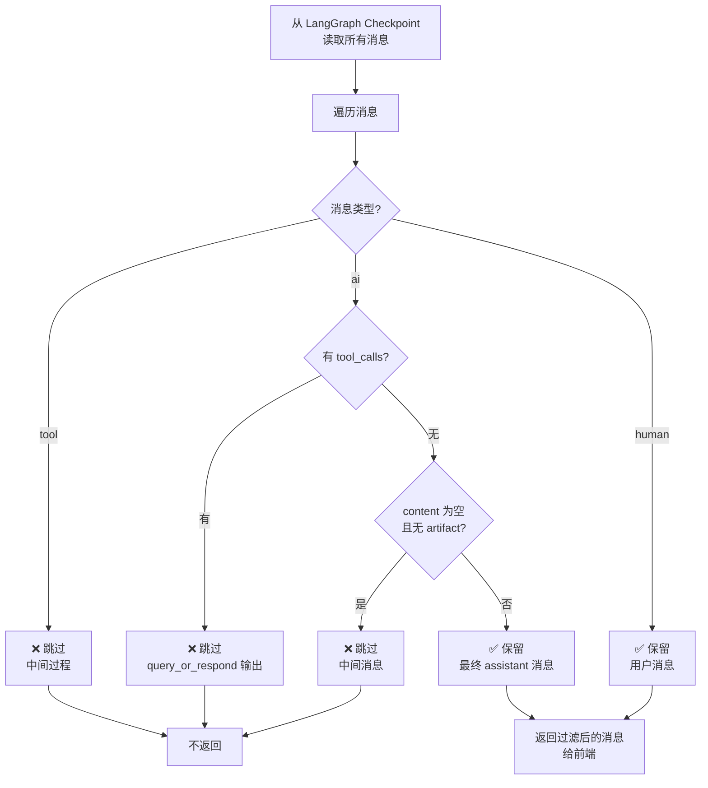
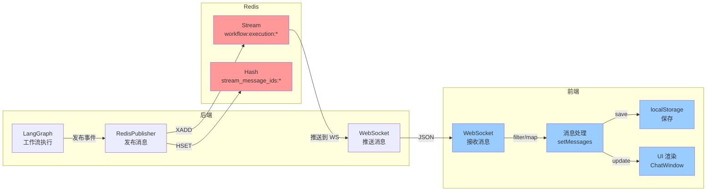

# Redis Stream 完整流程图

## 1. 实时对话流程（WebSocket + Redis Stream）



## 2. 页面刷新恢复流程



## 3. Redis Stream 数据结构



## 4. 前端状态管理流程



## 5. 消息过滤逻辑（后端 /history）



## 6. WebSocket 消息流向



## 7. 完整时序：从发送消息到显示回复

```
时间线：
├─ T0: 用户输入 "简单介绍象量科技的创始人"
│
├─ T1: 前端 POST /chat/stream
│       └─ 后端启动 LangGraph 工作流
│
├─ T2: 前端 WebSocket 连接
│       └─ 后端推送历史消息 (is_history=true)
│       └─ 前端加载历史（忽略 is_history）
│
├─ T3-T5: 工作流执行
│       ├─ query_or_respond 节点 (100ms)
│       │   └─ XADD → Redis Stream
│       │   └─ WebSocket 推送
│       │   └─ 前端显示"正在思考..."
│       │
│       ├─ tools 节点 (500ms)
│       │   └─ XADD → Redis Stream
│       │   └─ WebSocket 推送
│       │   └─ 前端显示"正在检索..."
│       │
│       └─ generate 节点 (2000ms)
│           ├─ Token 1: XADD → Redis
│           │   └─ WebSocket 推送
│           │   └─ 前端追加 "根"
│           │
│           ├─ Token 2: XADD → Redis
│           │   └─ WebSocket 推送
│           │   └─ 前端追加 "据"
│           │
│           └─ ... (更多 Token)
│               └─ 最终显示完整回复
│
├─ T6: 工作流完成
│       └─ 前端保存 last_id 到 localStorage
│       └─ 前端保存消息到 localStorage
│
└─ T7: 用户刷新页面
        ├─ 前端从 localStorage 快速恢复消息 (0ms)
        ├─ 前端 GET /history 获取最终消息 (100ms)
        │   └─ 后端返回过滤后的消息（只有用户提问 + 最终回复）
        ├─ 前端 WebSocket 连接 with last_id
        │   └─ 后端 XREAD 从 last_id 开始
        │   └─ 返回新消息（如有）
        └─ 用户看到完整的对话历史
```

## 关键特性

### ✅ 消息持久化
- Redis Stream 自动持久化所有消息
- XTRIM 限制长度（1000 条）
- EXPIRE 自动清理过期 key（1 小时）

### ✅ 消息续订
- 前端保存 `last_id` 到 localStorage
- 重连时通过 `?last_id=...` 参数传递
- 后端 XREAD 从指定位置开始读取

### ✅ 历史恢复
- 刷新后从 localStorage 快速恢复（毫秒级）
- 从后端 /history 获取最终消息
- 后端过滤中间消息，只返回最终问答

### ✅ 实时流式
- Token 级流式输出（message_type=token）
- 节点级完成事件（message_type=output）
- 前端实时追加 Token，用户看到逐字显示

### ✅ 无缝切换
- WebSocket 推送 `is_history` 标记
- 前端区分历史消息和新消息
- 避免重复处理和顺序混乱
